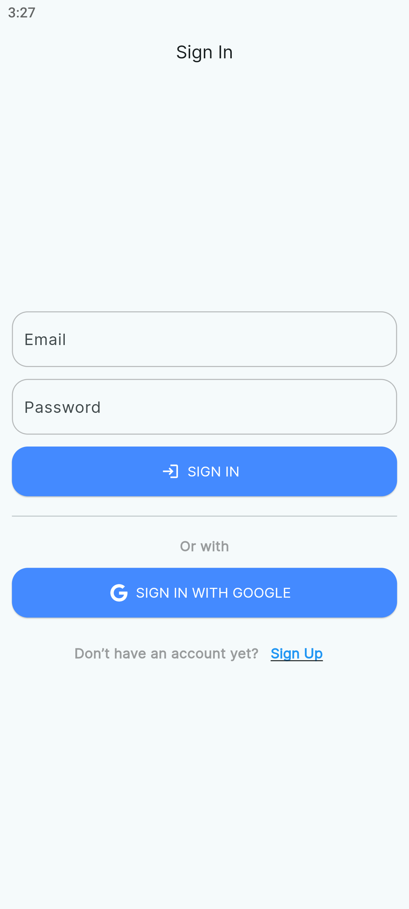
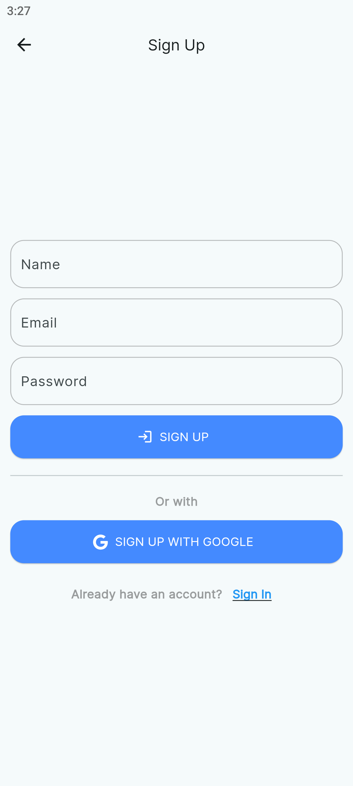
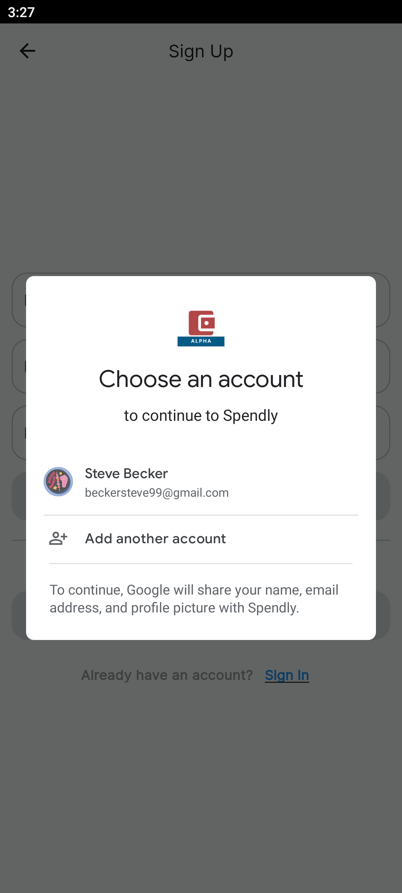
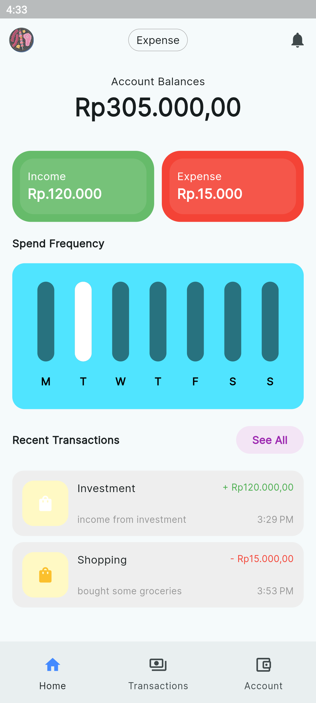
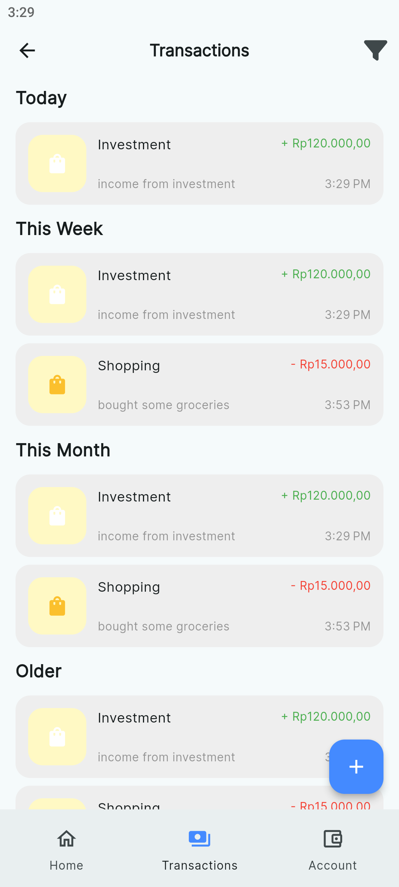
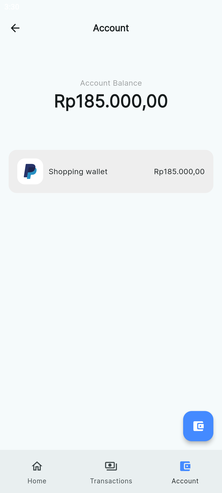
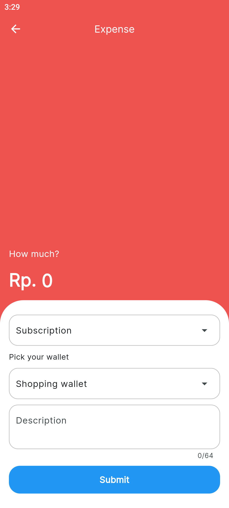
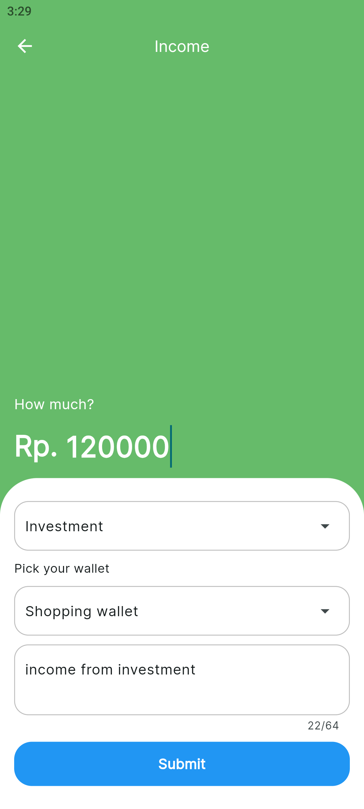
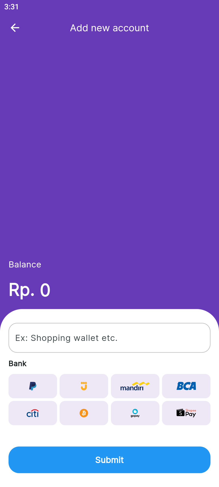
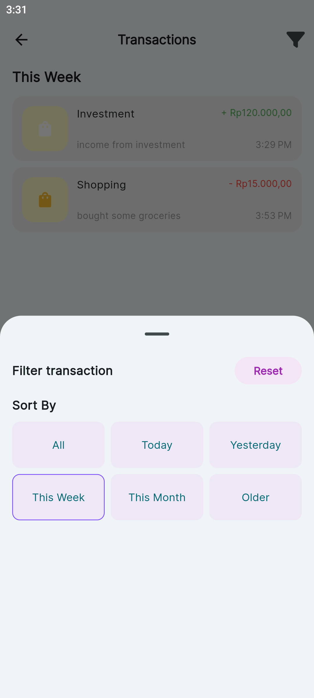

 
<h2 align="center"><b>Spendly</b></h2>

<h4 align="center">An expense tracker for Android.</h4>

<a href="https://github.com/hamzahraihan/flutter_expense_tracker/releases/download/v0.5.0-alpha/app-release.apk"></img></a>

  
  

<a href="#screenshots">Screenshots</a> &bull; <a href="#supported-services">Supported Services</a> &bull; <a href="#description">Description</a> &bull; <a href="#features">Features</a>

## Screenshots

## Supported Services

Spendly currently supports these services:

- Cloud Firestore
- Firebase Multi-factor Authentication

As you can see, Spendly only supports firebase as a database and authentication. It means that user must connect to network for the application to be function normally as it should.

Currently, Spendly is not support offline access.

## Description

Spendly works by fetching the required data from cloud firestore(a service from firebase). User must create an account to be able to use the app. This means that you need an account to use Spendly.

Spendly could track your expenses and incomes. Spendly has a feature to add a wallet. It means that you can create a different wallet with different purpose(e.g. shopping).

## Features

- Create an account using google or email
- Create expenses and incomes
- Create a wallet
- Show statistic of expenses and incomes
- View and search your transaction history
- Easy to use
